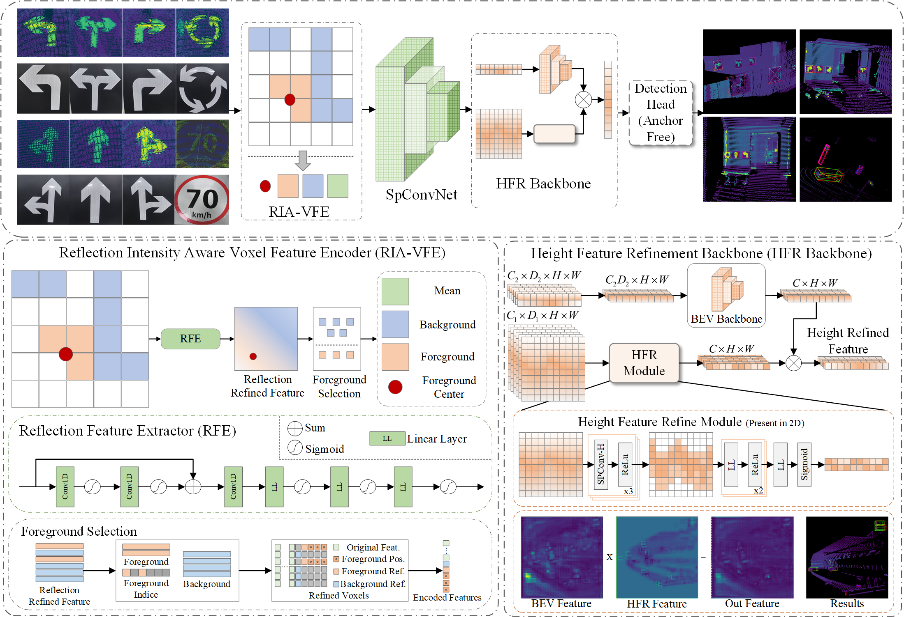

# ID-SSLNet
Source code of ID-SSLNet. 



## TODO
```

More information will be released.

Just follow the OpenPCDet repo to configure this repo.

```
## Acknowledgement
This project was completed based on OpenPCDet, and we thank OpenPCDet for its open-source nature. The link to OpenPCDet is as follows: https://github.com/open-mmlab/OpenPCDet
## Citation
If you find our work useful, please consider cite this repository.
```
@ARTICLE{11410064,
  author={Chen, Zhuo and Zhang, Zihan and Pan, Shuguo and Tao, Xianlu and Gao, Wang},
  journal={IEEE Sensors Journal}, 
  title={ID-SSLNet: Intensity Difference based Semi-Solid-State LiDAR Planar Markers Detection Network}, 
  year={2026},
  volume={},
  number={},
  pages={1-1},
  keywords={Laser radar;Feature extraction;Point cloud compression;Object detection;Imaging;Sensors;Accuracy;Reflectivity;Reflection;Semantics;Computer vision;object detection;autonomous driving;semi-solid-state LiDAR;sign recognition},
  doi={10.1109/JSEN.2026.3665301}}
```
